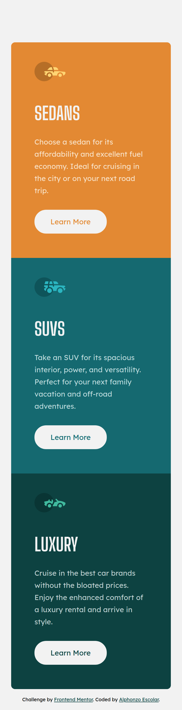
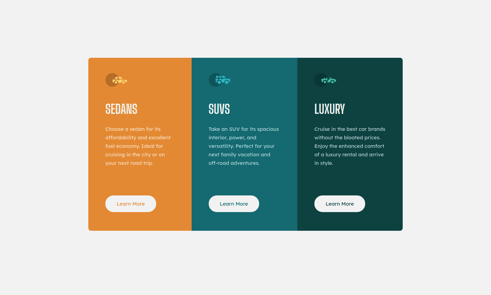

# Frontend Mentor - 3-column preview card component solution

This is a solution to the [3-column preview card component challenge on Frontend Mentor](https://www.frontendmentor.io/challenges/3column-preview-card-component-pH92eAR2-). Frontend Mentor challenges help you improve your coding skills by building realistic projects.

## Table of contents

- [Overview](#overview)
  - [The challenge](#the-challenge)
  - [Screenshot](#screenshot)
  - [Links](#links)
- [My process](#my-process)
  - [Built with](#built-with)
  - [What I learned](#what-i-learned)
  - [Continued development](#continued-development)
- [Author](#author)

## Overview

In this challenge, I forced myself to study and incorporate animations. I've been avoiding animations. It makes me uncomfortable especially when I see people doing cool things with it. I also just started learning JavaScript and tried adding a bit of it.

### The challenge

Users should be able to:

- View the optimal layout depending on their device's screen size
- See hover states for interactive elements

### Screenshot

### Links

- Solution URL: (https://github.com/phonz-dev/fem-3-column-preview-card)
- Live Site URL: (https://fem-3-column-preview-card-jade.vercel.app/)

## My Process

### Built with

- Semantic HTML5 markup
- CSS custom properties
- Flexbox
- Sass
- Mobile-first workflow
- Vanilla JavaScript

### What I learned

I learned that the major difference between CSS transition and CSS animation was that you have more control if you use animation. I also learned to use a loop to add event listeners to some elements instead of adding them one by one.

### Continued development

I would want to get more comfortable with CSS animations. Moving forward, I would find ways to incorporate animations for my future projects.

## Author

- Frontend Mentor - [@phonz-dev](https://www.frontendmentor.io/profile/phonz-dev)
- Twitter - [@phonz_dev](https://twitter.com/phonz_dev)
